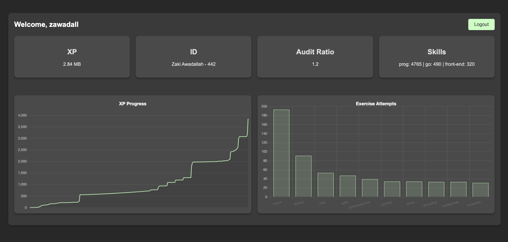

# GraphQL Profile Page

## Overview
This project is a personal profile page that connects to a GraphQL API to display my university data, such as XP, grades, and more. It also features interactive graphs built with SVG. The main goal was to learn GraphQL, authentication with JWT, and modern web development practices.

## Key Learnings
- **GraphQL**: Writing standard, nested, and argument-based queries
- **JWT Authentication**: Secure login and session management
- **API Integration**: Using REST for login and GraphQL for data
- **SVG**: Creating custom data visualizations
- **UI/UX**: Designing a clean and user-friendly interface
- **Hosting**: Deploying the project online

## Features
- **Login Page**: Secure authentication with error handling and logout
- **Profile Page**: Displays user data (XP, grades, audits, skills, etc.) from the API
- **Statistics Section**: SVG graphs showing user progress or achievements

## How to Use
1. Open `index.html` in your browser
2. Log in with your username/email and password
3. View your profile and statistics
4. Log out when finished

> **Note:** You need an account on the platform to use this app. If you do not have one, you cannot test the live features. A screenshot is provided below for reference.

## Screenshot



## Example GraphQL Queries
```graphql
{ user { id login } }
{ object(where: { id: { _eq: 3323 }}) { name type } }
{ result { id user { id login } } }
```

## API Endpoints
- GraphQL: `https://adam-jerusalem.nd.edu/api/graphql-engine/v1/graphql`
- Sign In: `https://adam-jerusalem.nd.edu/api/auth/signin`
